<h1 style="font-size:40px ;font-family: 'Courier New', Courier, monospace;">Statastics</h1>


sum = ∑ &nbsp;basically

```javascript
// code for sum -> 

const sum = (array)=> {
    let nice = 0;
    for (let index = 0; index < array.length; index++) {
        nice = nice +array[index];
        
    };
    return nice;
};
console.log(sum([1,2,3,4])); // output = 10
```


<h1 style="color:red">Mean</h1>
<h2 style="font-family: 'Courier New', Courier, monospace; color:cyan"> Arithematic</h2>

-  mean = X(bar) = sum(x)/n
- mean = x(bar) = sum(fx)/N  
where  N = sum(f)

- Z {average of 2 averages} =[ n1X + n2Y ] / n1+ n2

-  u = X-A/h , where u is the term we can use in place of x. 

- then <h2> X = A + h sum(fu)/sum(f)</h2>
<strong>where A is the assumed mean or the middle no. </strong>

```javascript 
const u = (x, a) => {
    const h = x[1] - x[0];
    const nu=[];
    for (let i = 0; i < x.length; i++){
        nu[i] = (x[i] - a) / h;
    }
    return nu;
}
console.log(u([2, 2.5, 3, 3.5, 4, 4.5, 5], 3.5));
// returns  an array u = x-A/h 
```

---
---
<h2 style="font-family: 'Courier New', Courier, monospace; color:yellow">Geometric</h2>

- GM = (x1 * x2 * x3 * x4 ....* xn )**(1/n)
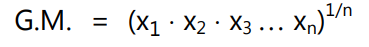
- bigger form with fx will be : 
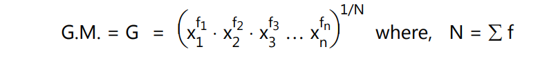

 <h2> GM = antilog( sum(f * log(x) ))</h2>

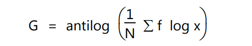

- log(GM) =   n1 log(G1) + n2 log(G2) / n1 + n2 

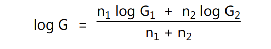

```javascript
const Gm =(x , f)=>{
    let geom = 1;
    const  n = sum(f);
    for(let i = 0 ; i < x.length, i++){
        // nice
        geom *= x[i]*f[i]
    }
    return (geom**(1/n));
};
//returns the geometric mean of the number as soon as p. 
```

---
---


<h2 style="color:limegreen; font-family:'Courier New', Courier, monospace; ">Harmonic </h2>

- HM = 1/ (  1/N  *  sum( f/ x)       )
- tis the reciprocal of arithematic mean . 


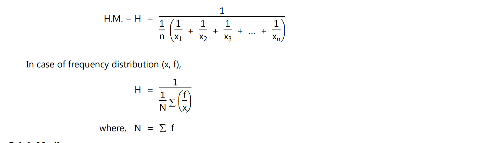


```javascript
const HM = (f, x)=>{
    let harmo = 1/ sum(f);
        for(let i = 0 ; i < x.length, i++){
        harmo /= (f[i]/x[i]);
    }
    return (harmo);
}
```


---
---
<br>
<h1  style="color:blue"> MEDIAN</h1>

- most of the time it is the middle element of the freq distribution. <br>
<code>basic formula = 1/2 ( n/2 th char  +  ( n+1 )/2 th char )</code>
```javascript

const Median = x => {
    let n = sum( x);
    let med = 0.5 * ( 0.5 * n + 0.5 * (n+1));
    return med ;
}

// returns the median properly.

```
- the formula for median in a grouped data is as follows . 

<code>median =  l + h/f ( N /2 - c)</code><br>
- where L = lower limit of the median class 
- h = median width 
- f = freq of median class 
- c = c.f of class preceeding median. 

---
---
<br>
<h1 style="color:red">MODE</h1>

- It is the value of the variate which occurs most frequently in a set of *observations*, or is the value of variate corresponding to 
maximum frequency

<code>mode = l + h *  [(f1- f0)]/[2f1 -f0 - f2]</code>


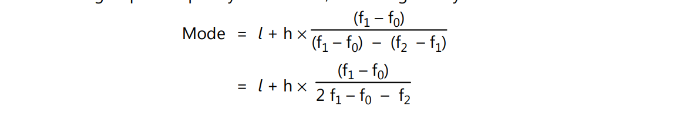

- where 
    - L = lower limit . 
    - h =width of modal class . 
    - f1 = freq of modal class
    - f0 = freq of class **before** the modal class
    - f2 = freq of class **after** the modal class
---
---
<h1 style="color:Yellow">Mean Deviation</h1>

- the mean deviation = 
<code>1/n * SUM(X-A)    </code>
-  It is defined as the arithmetic mean of absolute deviations from any average is called as mean 
deviation about the respective average.
- other formula = ```1/N * sum(  F*(x-A)  ) ```
- where **A=mean**

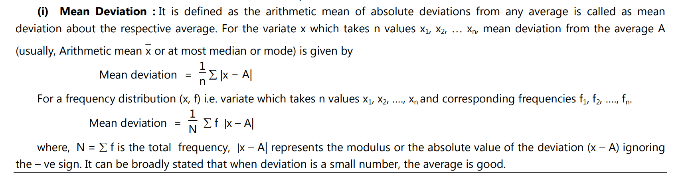

---
---
<h1 style="color:pink">Variance (σ**2)</h1>

- variance <code>=1/n sum(x - mean)**2</code>
- var is also the square of std deviation . 
- <h2>σ**2 = [1/N * sum (f* x**2)]  -  [1/N * sum(f * x) ]**2</h2>


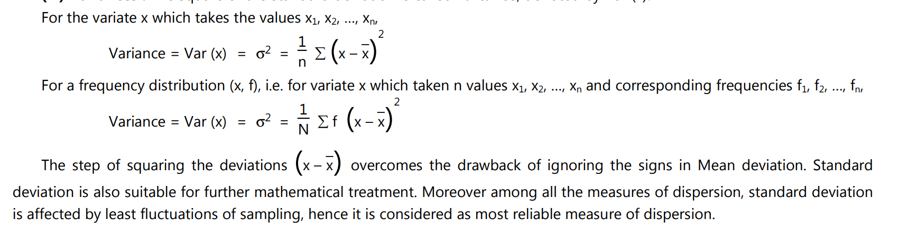


---
---
<h1 style="color:brown">S.D.(σ)</h1>
- σ = <code>
  root( sum(f*u**2)/N    - ( sum(fu)/n)**2       )
  </code>
  <br>
  <h3> RMS = <code>S**2
 = σ**2
 + d**2
, where d = 
x – A</code></h3>

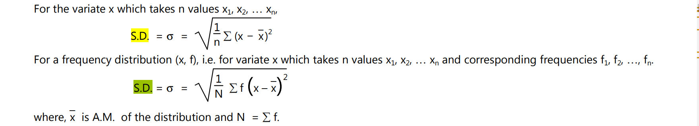
---
---
<h1 style="color:orange ">Coefficient Of Variation</h1>

- <h2>C.V. = σ / A.M. * 100 </h2>

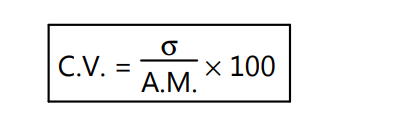


- where **A.M = arithematic mean**
- and **σ = S.D**
- shows the variability of the **series**
- ``` the greater the cv the greater the variability  ```.
---
---
<h1 style="color: coral; font-family: cursive;">MOMENT , SKEWNESS AND KURTOSIS.</h1>

- So far we have studied tow aspects of frequency distribution viz. average and dispersion. In order to study few more 
aspects such as symmetry, shape of the frequency distribution (or frequency curve), more general type of descriptive 
measure called moments are useful. 

<h1 style="color:yellow">MOMENT</h1>

- The rth moment about the mean X (or central moment): 
-  µr is given by 
<br>
<code> µr = 1/N * [ sum( F * ( x - X)**r)] </code>

- where N = sum(f)

- 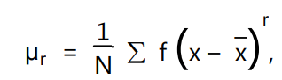

- this means that the : 
- 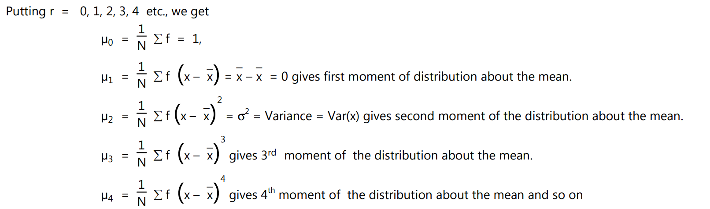
    - this is a valid solution but calculating x - X is hard upon itself . 
    - which is why we use **A or  some arbitary number**

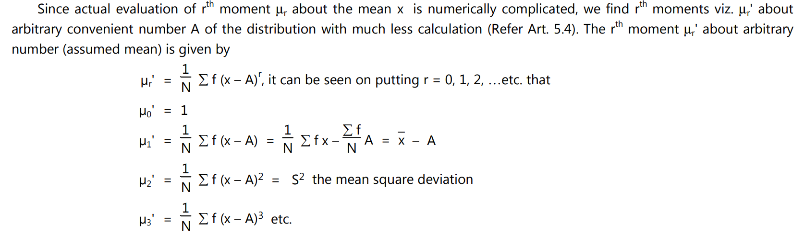


<h2 style="color:limegreen">and the relation between them is </h2>

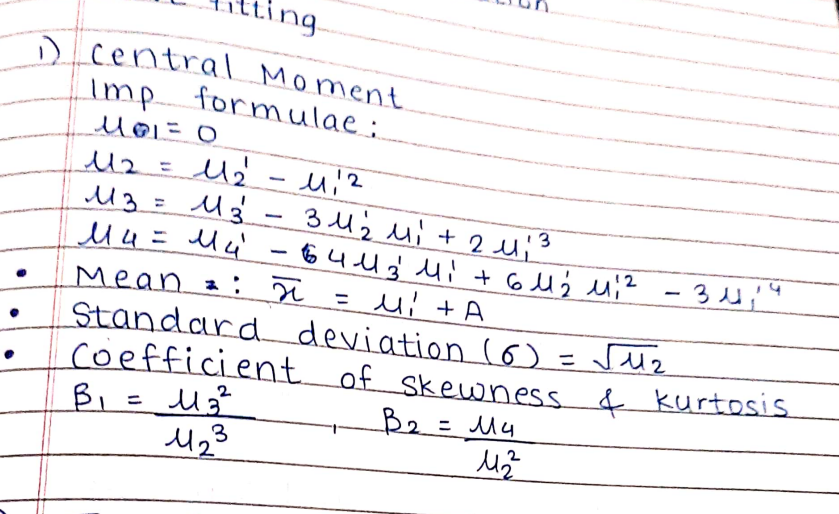

- also there is another form to consider 

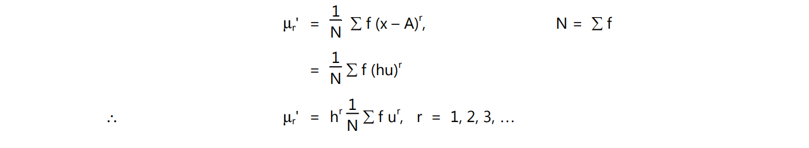


<h1 style="font-size:40px; font-family:'Courier New', Courier, monospace;">Skewness</h1>

- A frequency distribution is symmetric above a value 'a' (say);
-  if the corresponding frequency curve is symmetric about a.


-  For 
symmetric frequency curve, the point 'a' turns out to be arithmetic **mean, mode as well as median**.
- Skewness signifies departure from symmetry (or a lacks of symmetry).
- We study skewness to have an idea about the shape of 
the curve which we draw with the given data.
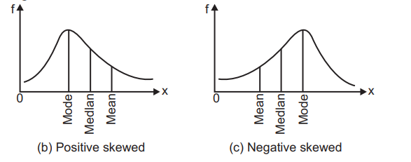

- skewness is given by the following formula : 
- 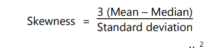
- this is an accurate depiction of skewness and we also have **coefficient of skewness**
- formula for <h1 style="color:red;font-family:'Courier New', Courier, monospace; font-weight:900 ">coefficient of skewness</h1> is : 
    - 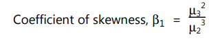
    - which is a better way to judge the skewness : 
        - if **COS < 0**: negatively skewed.   l 
        - if **COS>0**: positively skewed .

<h1 style="color:limegreen ; font-family:'Courier New', Courier, monospace; ">Kurtosis</h1>

- this measures the flatness or the peakness of the bell curve . 
- which is helpful for maybe approximation of the curve and  checking the average value and variances . 
- so how to calculate. 
- 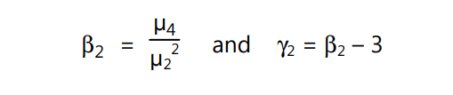
- why 3 , becox for a normal deviation bell curve the β2 = 3, 
- which gives us the graphs : 
- 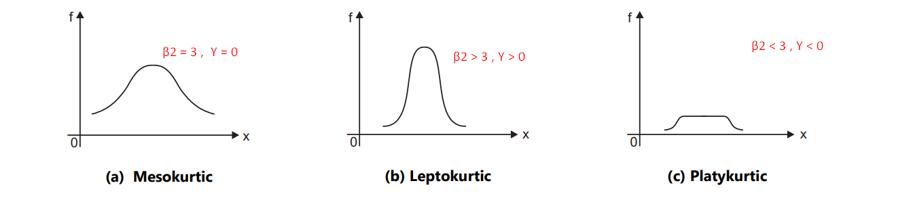

---
---
<h1 style="color:pink; font-family:consolas,monaco,monospace;  "> coefficient of corelation</h1>


-  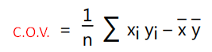
-  